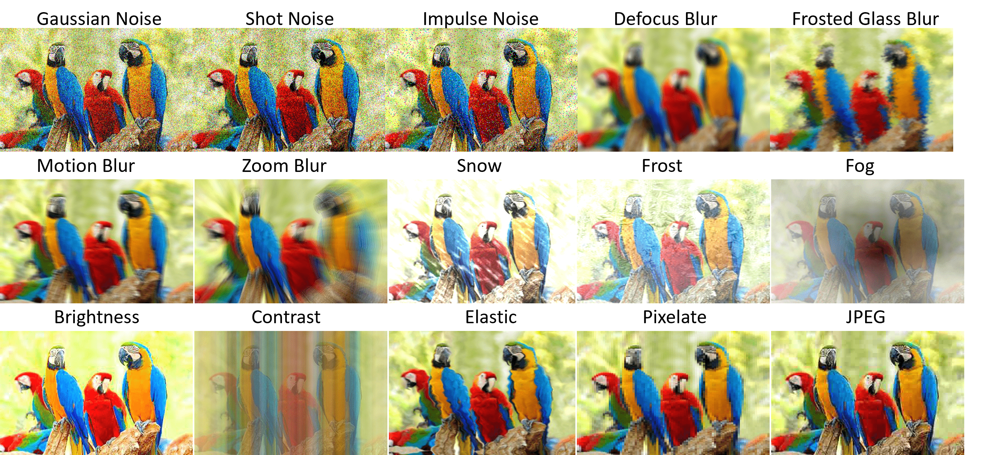
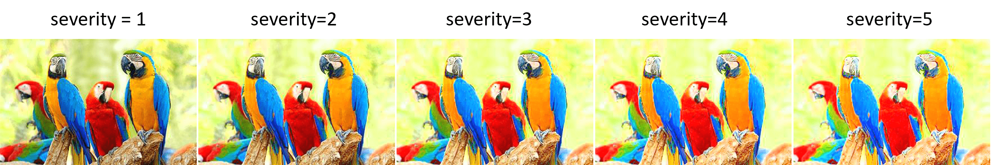
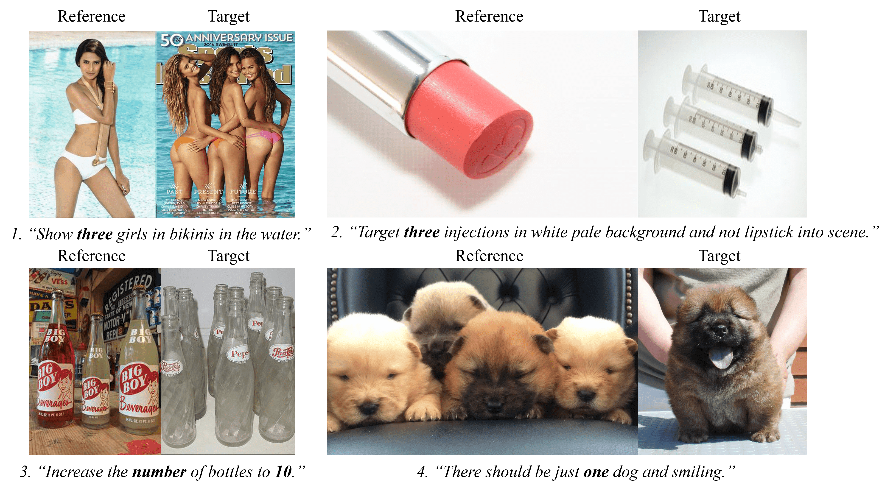
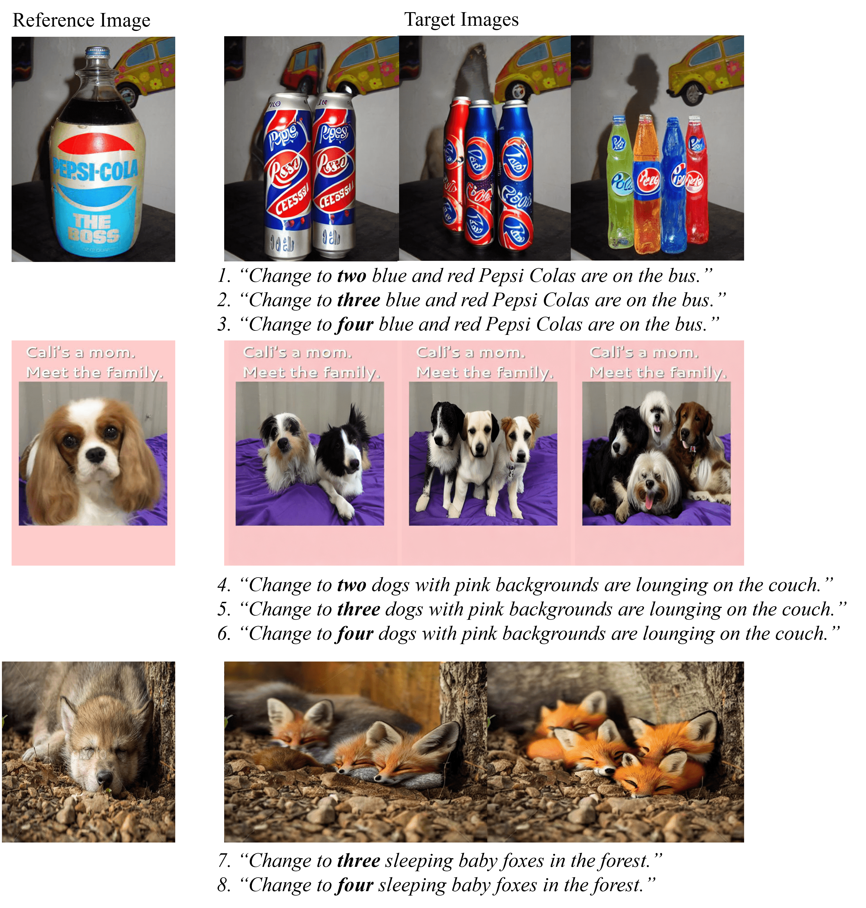
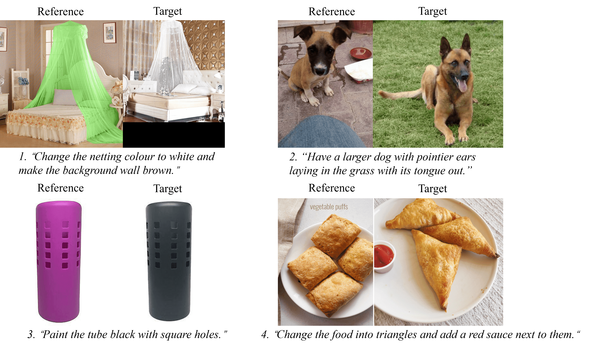
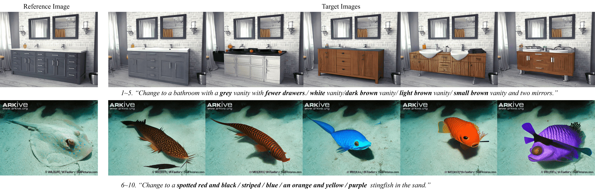
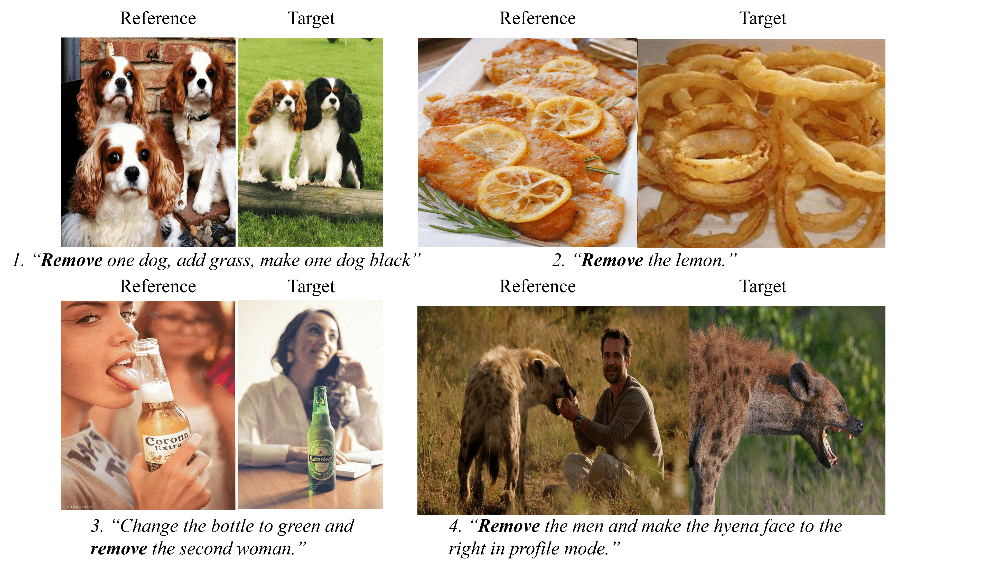
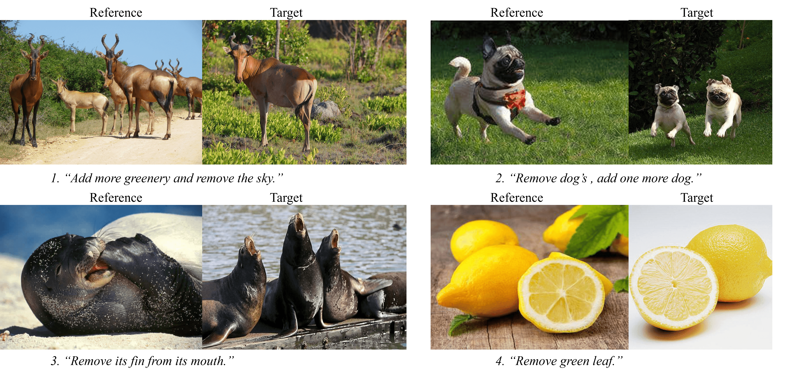
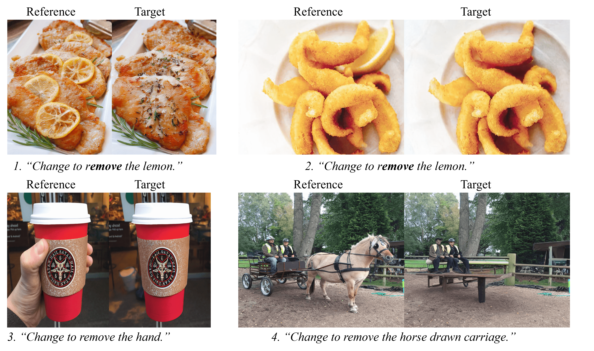
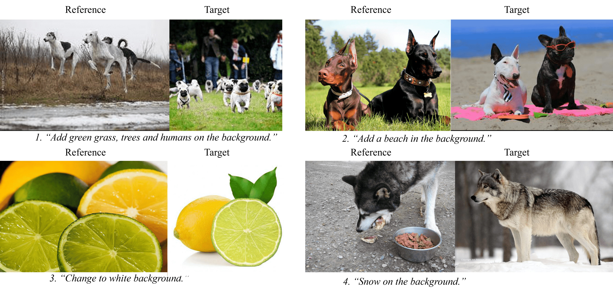

## Benchmarking Robustness of Text-Image Composed Retrieval


## CIRR-C

#### Download:
Download original CIRR from [link](https://drive.google.com/drive/folders/1_D8vaSlLHl-5FUJxI8_mnEFWWzu-4_Dz?usp=drive_link).

#### Apply image corruption on CIRR

Apply the following image corruption in dataloader can achieve corrupted images for the 15 corruptions.  

```python
import corrupt.image_corrupt as img_crpt
from PIL import Image
import numpy as np

# 15 standard corruptions
IMG_CORRUPTS=["gaussian_noise_filter", "shot_noise_filter", "impulse_noise_filter", "motion_blur_filter", "defocus_blur_filter", "zoom_blur_filter", "brightness_filter", "contrast_filter",  "pixelate_filter", "jpeg_compression", "fog" ,"snow", "frost", "glass_blur", "elastic_transform"]

corrupt = IMG_CORRUPTS[0]  # take gaussian noise filter as example
img_path = './sample.png'
image = Image.open(img_path).convert('RGB')
image = np.array(image)
img_corrupt_func = getattr(img_crpt,corrupt)
image = img_corrupt_func([image], scale=level)[0]
image = Image.fromarray(image)
image = image.save('corrupted_sample.png')
```

#### Visualization of image corruptions


#### Brightness corruption severity



#### Text corruption on CIRR

```python
from corrupt.text_corrupt import *

TEXT_CORRUPTS = ['character_filter','qwerty_filter','RemoveChar_filter','remove_space_filter',  'misspelling_filter', 'repetition_filter','homophones_filter']
text_sample = 'There were two adult dogs on the road - there was one grown puppy in the yard.'
for corrupt in TEXT_CORRUPTS:
  corrupt='remove_space_filter'
  text_corrupt_func = getattr(txt_crpt,corrupt)
  corrupted_sent, levenshtein_dist = text_corrupt_func(text_sample, 3)
  print(corrupt)
  print(corrupted_sent)


##### Result:#########
character_filter
['There were two adutl dogs on teh road - there wsa oen grown puppy in the yard.']

qwerty_filter
['There were two adult dogs on the road - there was one grow5 puppy in the yard.']

RemoveChar_filter
['Thre were two adult dogs on the road - tere ws ne grown puppy in the yard.']

remove_space_filter
['There were two adult dogs onthe road - there was one grown puppy in the yard.']

misspelling_filter
['There were were two adult dogs on the road - there was one grown puppy in the yard.']

repetition_filter
['There were two adult adult dogs on the road - there was one grown grown puppy in the yard.']

homophones_filter
["They're were two adult dogs on the rowed - their was won grown puppy inn the yard."]

```


## FashionIQ-C

#### Download
Download original FashionIQ from [link](https://drive.google.com/drive/folders/14JG_w0V58iex62bVUHSBDYGBUECbDdx9).

#### Apply image corruption on FashionIQ

Same as in CIRR-C

#### Apply text corruption on FashionIQ

Same as in CIRR-C

## CIRR-D
#### Download 
Download from [link](https://drive.google.com/drive/folders/1L119pdiG7aC_Z48oh_x4h3oXmz0faxV9?usp=sharing)

#### Samples Visualization
#### Numerical
+ Samples from original CIRR
We sample the triplets from original CIRR dataset and categoriy them into numerical type when the modified text include number "zero" - "ten" or "number". For each triplet below, the image on the left is the reference image. According to the reference image and the modified text, we aim to retrieve the target image on the right. 

+ Samples from Synthetic data
We Further generate images based on current CIRR dev set. Our generation is based on [Visual ChatGPT](https://github.com/microsoft/TaskMatrix).


##### Attribute
+ Samples from original CIRR

+ Samples from Synthetic data


##### Object removal
+ Samples from original CIRR

+ Samples from extend caption of original CIRR


+ Samples from Synthetic data

##### Background
+ Samples from original CIRR


+ Samples from extend caption of original CIRR
We select the triplets from extended captions, where background is the major change between the image pair. 


##### Fine-grained 
Gallery of fine-grained category is composed of 


### Testbed Requirements

```
conda env create -f hugface.yml
```

<!-- 
## Training and Evaluation

To help researchers reproduce the benchmark results provided in our leaderboard, we include a simple framework for training and evaluating the spatial-temporal models in the folder: benchmark_framework.

## Running the code

Assume the structure of data directories is the following:

```misc
~/
  datadir/
    mini_kinetics/
      train/
        .../ (directories of class names)
          ...(hdf5 file containing video frames)
    mini_kinetics-c/
      .../ (directories of corruption names)
        .../ (directories of severity level)
          .../ (directories of class names)
            ...(hdf5 file containing video frames)
```
Train I3D on the Mini Kinetics dataset with 4 GPUs and 16 CPU threads (for data loading). The input lenght is 32, the batch size is 32 and learning rate is 0.01.
```buildoutcfg
python3 train.py --threed_data --dataset mini_kinetics400 --frames_per_group 1 --groups 32 --logdir snapshots/ \
--lr 0.01 --backbone_net i3d -b 32 -j 16 --cuda 0,1,2,3

```
Test I3D on the Mini Kinetics-C dataset (pretrained model is loaded)
```buildoutcfg
python3 test_corruption.py --threed_data --dataset mini_kinetics400 --frames_per_group 1 --groups 32 --logdir snapshots/ \
--pretrained snapshots/mini_kinetics400-rgb-i3d_v2-ts-max-f32-cosine-bs32-e50-v1/model_best.pth.tar --backbone_net i3d -b 32 -j 16 -e --cuda 0,1,2,3

``` -->